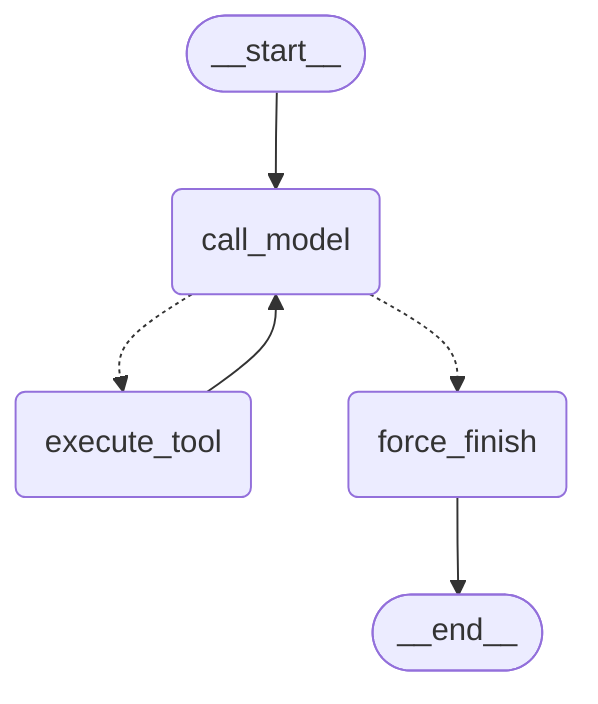
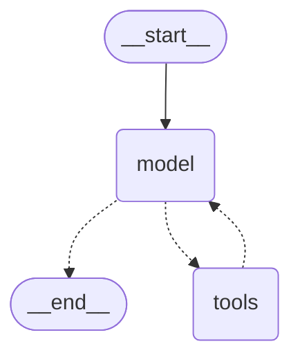

# Блок 6.3 — LangGraph: перенос ReAct-агента из Б6.2

`app/services/agent_graph.py` переводит ReAct-цикл из `agent_react.py` (Б6.2)
в orchestration-форму LangGraph 1.x: два независимых runnable на одном
наборе tools — `custom_graph` (`StateGraph` руками) и `prebuilt_graph`
(`langchain.agents.create_agent`).

## 1. Конфигурация

- Модель: `settings.openai.model` (Groq `openai/gpt-oss-120b`), `temperature=0`
  — тот же сдвиг "Groq вместо OpenAI/gpt-5.4-mini", что и во всём проекте.
- `MAX_ITERATIONS = 6` (жёстко, как в задании — не вынесено в settings).
- Tools (3, перенесены из `agent_react.py` без изменения description/докстрок):
  `search_knowledge_base`, `get_current_time`, `send_telegram_message`.
- Системный промпт — `SYSTEM_PROMPT`, импортирован напрямую из
  `agent_react.py` (не продублирован), чтобы сравнение в
  `scripts/bench_agents.py` было на одном и том же промпте во всех трёх
  реализациях.

## 2. State contract

```python
class AgentState(TypedDict):
    messages: Annotated[list[AnyMessage], add_messages]
    iteration_count: int
    tool_results: Annotated[list[dict], operator.add]
```

- `messages` — история диалога (`add_messages`: новые сообщения дописываются
  и матчатся по `id` для обновлений, а не молча перезаписывают список — см.
  баг №1 ниже).
- `iteration_count` — обычный `int`, reducer по умолчанию `replace`: каждый
  `call_model` явно возвращает `state["iteration_count"] + 1`, счётчик живёт
  вне messages.
- `tool_results` — `operator.add`: каждый `execute_tool` возвращает список
  новых записей `{name, args, result}`, которые **накопительно** добавляются
  к прежним — используется для отчёта/трейсинга, а не для принятия решений
  внутри графа.
- В state нет SDK-клиентов, http-сессий, API-ключей — `model`/`TOOLS` живут
  как модульные глобалы вне state, полностью сериализуемого.

## 3. Router и stop-conditions

```python
def route_after_model(state: AgentState) -> Literal["execute_tool", "force_finish"]:
    if state["iteration_count"] >= MAX_ITERATIONS:
        return "force_finish"
    last = state["messages"][-1]
    return "execute_tool" if getattr(last, "tool_calls", None) else "force_finish"
```

Чистая функция: только читает `state`, ничего не пишет, не делает сетевых
вызовов, типизирована через `Literal[...]`. Проверка `iteration_count`
стоит **первой** — это осознанно (см. баг №1): даже если у последнего
сообщения есть незакрытый `tool_calls`, при достижении лимита граф уходит в
`force_finish`, а не в `execute_tool`. `force_finish` в этом случае
синтезирует явное сообщение (`"Превышен лимит итераций..."`) — без этого
граф ушёл бы в `END` с последним сообщением-заглушкой без ответа
пользователю.

## 4. Mermaid-схема `custom_graph`



Для сравнения — внутренняя схема `prebuilt_graph` (`create_agent`), два
узла (`model`/`tools`) вместо трёх у кастомного:



Оба файла — `docs/agent-graph-custom.mmd`/`docs/agent-graph-prebuilt.mmd` —
дополнительно экспортированы в PNG (`docs/agent-graph-custom.png`,
`docs/agent-graph-prebuilt.png`) через `draw_mermaid_png()`.

## 5. Бенчмарк: Б6.2 (`agent_react.py`) vs `custom_graph` vs `prebuilt_graph`

Реальный прогон `scripts/bench_agents.py`, 2026-08-06, те же 5 задач, что и
в Б6.2 (`docs/agent-react-report.md`), 3 повтора на пару (задача,
реализация) = 45 запусков. Сырые данные — `docs/agent-graph-bench-raw.json`.

| # | Задача | Реализация | latency_ms (avg) | prompt_tokens (avg) | completion_tokens (avg) | total_steps (avg) |
|---|--------|------------|-------------------|----------------------|--------------------------|--------------------|
| 1 | Стандартная комиссия (1 tool) | react | 1 707 | 1 985 | 174 | 2.0 |
| 1 | Стандартная комиссия (1 tool) | custom | 1 633 | 1 558 | 125 | 2.0 |
| 1 | Стандартная комиссия (1 tool) | prebuilt | 9 027 | 1 558 | 125 | 2.0 |
| 2 | Текущее время в Алматы (1 tool) | react | 10 741 | 1 788 | 166 | 2.0 |
| 2 | Текущее время в Алматы (1 tool) | custom | 7 733 | 1 454 | 123 | 2.0 |
| 2 | Текущее время в Алматы (1 tool) | prebuilt | 6 489 | 1 454 | 126 | 2.0 |
| 3 | KB→Telegram (composability) | react | 15 393 | 3 307 | 377 | 3.0 |
| 3 | KB→Telegram (composability) | custom | 12 120 | 2 469 | 236 | 3.0 |
| 3 | KB→Telegram (composability) | prebuilt | 12 908 | 2 469 | 237 | 3.0 |
| 4 | time→Telegram (composability) | react | 18 314 | 3 884 | 421 | 3.7 |
| 4 | time→Telegram (composability) | custom | 10 610 | 2 331 | 260 | 3.0 |
| 4 | time→Telegram (composability) | prebuilt | 11 862 | 2 328 | 261 | 3.0 |
| 5 | Проверка баланса (провокационная — без tool) | react | 5 106 | 723 | 146 | 1.0 |
| 5 | Проверка баланса (провокационная — без tool) | custom | 4 913 | 704 | 115 | 1.0 |
| 5 | Проверка баланса (провокационная — без tool) | prebuilt | 2 135 | 704 | 125 | 1.0 |

**Методологическая оговорка про latency**: прогон шёл под плотным Groq
429-рейтлимитом (видно в логе — `Retrying request to /chat/completions in
N seconds` почти на каждом втором вызове), а порядок вызовов внутри задачи
фиксированный (react → custom → prebuilt), так что `prebuilt` систематически
принимает на себя накопленное давление лимита после первых двух реализаций
той же задачи. Задача 1: latency `prebuilt` (9 027 мс) стабильно выше
`react`/`custom` (~1 700 мс) **на всех 3 повторах**, при абсолютно
одинаковом числе токенов/шагов — то есть разница не в устройстве
`prebuilt`, а в том, что к его прогону API уже придерживал запросы. Задача
2 показывает то же самое хаотично для всех трёх реализаций (разброс
3 300–14 000 мс без видимой связи с реализацией). **Числа по токенам и
`total_steps` не подвержены этому шуму (они не зависят от сетевой
задержки) — им можно доверять напрямую; latency читать направленно, не как
точный микробенчмарк одной реализации против другой.**

Что видно по токенам, несмотря на шум latency: `react` (Б6.2) стабильно
дороже `custom`/`prebuilt` на 25-40% по `prompt_tokens` (например задача 3:
3 307 vs 2 469) — прямое следствие self-reflection: у `react` есть
дополнительный critic-вызов после каждой tool observation, которого нет ни
у `custom_graph`, ни у `prebuilt_graph` (ни один из них не переносил
Reflexion-light — задание просило перенести только ReAct-цикл, не критика).
`custom` и `prebuilt` при этом почти идентичны по токенам на каждой
задаче (например задача 4: 2 331 vs 2 328) — ожидаемо, у обоих один и тот же
`model`/`tools`/`system_prompt` и одна и та же базовая механика ReAct, разница
только в orchestration-коде вокруг.

Задача 4 (`react`, `total_steps`=3.7 вместо 3.0): один из 3 прогонов задел
найденный в Б6.2 краевой случай — модель вернула `content=""` без
`tool_calls` (`react.empty_response` в логе), fix из Б6.2 сработал (не
завершился молча с пустым ответом, доработал лишний шаг) — то же самое не
воспроизводимо у `custom`/`prebuilt`, так как этот guard есть только в коде
`agent_react.py` и не переносился в `agent_graph.py` (нет self-reflection —
нет и этого конкретного фикса; сам LangGraph ничего похожего не даёт из
коробки).

## 6. Custom vs prebuilt

**Что пришлось писать руками (custom):** весь router (`route_after_model`),
явный узел `force_finish` со своим текстом при исчерпании лимита, ручной
разбор `tool_calls`/сборка `ToolMessage`, `tool_results`-аккумулятор для
трейсинга, весь `AgentState` с ручными reducer'ами.

**Что `create_agent` сделал самостоятельно:** внутренний граф `model ⇄
tools → END` (2 узла вместо 3, mermaid-схема раздела 4), инъекция
`system_prompt`, привязка tools к модели, весь message-flow — вызывающему
коду не нужно ни собирать `AgentState`, ни считать итерации, ни писать
router.

**Но у `prebuilt_graph` в этой конфигурации нет явного stop-крана.**
Проверено эмпирически: заставил модель (реальный вызов, не мок) бесконечно
звать заведомо ломаный `get_current_time` с несуществующим часовым поясом.
Модель сама распознала цикл и остановилась текстом "Извините, кажется, я
застрял в цикле" — но это решение модели, а не гарантия кода. Без
`interrupt_after`/явного лимита шагов `prebuilt_graph` в худшем случае
доехал бы до дефолтного `recursion_limit=25` самого LangGraph и упал бы с
`GraphRecursionError` (необработанное исключение, а не аккуратное
сообщение пользователю) — качественно хуже, чем детерминированный
`force_finish` у `custom_graph` на шаге 6. Для diploма-агента с прод-требованиями
к отказоустойчивости `custom_graph` предпочтительнее именно по этой
причине; `prebuilt` — там, где скорость сборки важнее контроля над
stop-conditions (прототип, внутренний инструмент с доверенным пользователем).

**Тестируемость тоже разная.** У `custom_graph` `call_model` каждый раз
берёт `model_with_tools` через module-level lookup — можно подменить мок
между вызовами (`mocker.patch("app.services.agent_graph.model_with_tools",
...)`, см. `tests/unit/test_agent_graph.py`). `create_agent` захватывает
переданный `model` в свой граф на этапе сборки — патч module-level `model`
**после** того, как `prebuilt_graph` уже собран, не перехватывается: живой
прогон (см. баг №2) молча ушёл в реальный Groq API вместо мока.

## 7. Баги, найденные при отладке

1. **Router проверяет `iteration_count` раньше `tool_calls` — `execute_tool`
   физически выполняется `MAX_ITERATIONS - 1` раз, не `MAX_ITERATIONS`.**
   Написал тест, ожидая `len(tool_results) == 6` при `MAX_ITERATIONS=6` — тест
   упал с `5 == 6`. Причина не в баге, а в порядке проверок
   `route_after_model`: на 6-й итерации `iteration_count>=6` уже истинно, и
   роутер уходит в `force_finish`, даже если у последнего сообщения есть
   незакрытый `tool_calls` — этот tool_call просто никогда не выполняется.
   Это ровно то, для чего нужен `force_finish` (не дать графу зависнуть на
   незакрытом вызове), но пока не наткнулся на тест, ожидал другое число.
2. **`create_agent` захватывает `model` по значению на этапе сборки —
   патчинг модуля постфактум не работает.** Пытался проверить поведение
   `prebuilt_graph` при зацикливании, подменив `app.services.agent_graph.model`
   моком уже после того, как `prebuilt_graph` собран на уровне модуля —
   тест тихо сходил в реальный Groq API (видно по `HTTP Request: POST
   .../chat/completions "200 OK"` в выводе) вместо использования мока.
   `custom_graph`, наоборот, спокойно мокается через
   `model_with_tools` — потому что `call_model` каждый раз читает его как
   module-global заново, а не захватывает в закрытие на этапе сборки графа.
   Пришлось тестировать реальным (недорогим) вызовом вместо мока для этого
   конкретного сценария.

## 8. Что блокирует переход к персистентности/чекпойнтингу

- `custom_graph.ainvoke(..., config={"configurable": {"thread_id": ...}})` —
  уже вызывается с `thread_id` (см. `run_custom()`/`bench_agents.py`, бонус
  из задания). Сейчас, без `checkpointer=` в `builder.compile()`, это
  честный no-op — LangGraph просто игнорирует `thread_id`, не сохраняя
  состояние между вызовами.
- Для реального чекпойнтинга нужно: (1) поднять `AsyncSqliteSaver`/
  `AsyncPostgresSaver` (проект уже использует Postgres для `app/chat/` —
  естественный кандидат вместо отдельного sqlite-файла), (2) передать его в
  `builder.compile(checkpointer=...)`, (3) решить, что при повторном вызове
  с тем же `thread_id` НЕ пересоздавать `iteration_count`/`tool_results` с
  нуля — сейчас `run_custom()` жёстко проставляет `"iteration_count": 0` в
  каждом вызове, что при живом checkpointer перезапишет восстановленное
  состояние. Это не баг сейчас (checkpointer не подключён), но при
  подключении текущий вызывающий код (`run_custom`) придётся поправить —
  начальный state нужно передавать только на первом сообщении треда, а не
  на каждом вызове.
- `interrupt`/human-in-the-loop не тронут вовсе — ни один узел не помечен
  `interrupt_before`/`interrupt_after`. Естественная точка для будущего
  HITL — перед `execute_tool` (подтверждение перед вызовом `send_telegram_message`
  как побочного эффекта с реальным адресатом).
