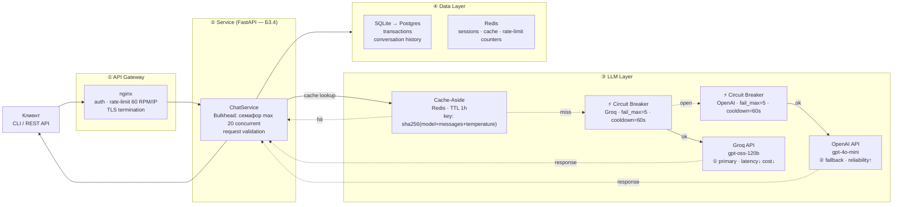

# Архитектурный паспорт: FinPay Support Assistant

## Диаграмма компонентов



**Обозначения:**
- `⚡ Circuit Breaker` — размыкается при 5 ошибках подряд, cooldown 60 с; по одному на провайдера
- `Cache-Aside` — стоит перед LLM-слоем; при hit возвращает ответ без LLM-вызова
- `→` — основной поток запроса; `-.->` — fallback / cache hit

---

## ADR-001: Выбор паттерна взаимодействия

**Context.**
Проект — ассистент (впоследствии чат бот) техподдержки платёжного процессинга FinPay для мерчантов
и разработчиков. Сценарий: пользователь задаёт вопрос о транзакции / статусе сервиса /
политике возврата, ассистент отвечает. Ожидаемая нагрузка — 20 RPM в штатном режиме,
пик до 60 RPM; средний ответ — 200–400 токенов (2–5 с генерации).
Клиенты на текущем этапе — CLI и REST API; в М4 подключается Telegram-бот.
Бюджет — $20/мес.

**Decision.**
Выбран паттерн **Request-Response**. Клиент отправляет запрос и
получает полный ответ одним телом. Ответы поддержки — короткие и структурированные;
задержка 2–5с приемлема для консольного и REST-клиента. Function Calling требует
двух последовательных LLM-вызовов — стриминг для техподдержки не является необходимым условием,
особенно в разрезе того что мы работаем больше с мерчантами.
Даже больше бы добавил что стриминг наоборот вызовет вопросы что общение идет с ИИ, а не реальным человеком.

**Consequences**
* Преимуществом является простота и понятность взаимодействия. 
Некоторая гибкость решения: можно как ТГ бота сделать, так и чат на сайте и т.п.
* Минусом является возможные риски потери клиента при долгом формировании ответа.
Но в плане тех поддержки фин процессинга это не критично поскольку это больше взаимодействие бизнеса с бизнесом.

**Alternatives considered.**
- **Streaming (SSE)** — отвергнут на текущем этапе: усложняет двухшаговый
  Function Calling цикл; nginx требует отдельной настройки; клиентов с живым UX пока нет.
- **Queue-based (async)** — отвергнут: для интерактивной поддержки избыточен;
  добавляет worker-процессы и polling, увеличивая операционную сложность. 
  Нужен будет разве что для более точных действий типа отправить коллбэки по платежу в фоне.

---

## ADR-002: Стратегия fault tolerance

**Decision.**
Провайдеры в порядке приоритета:

| Приоритет  | Провайдер | Модель                | Обоснование                                                                                  |
|------------|-----------|-----------------------|----------------------------------------------------------------------------------------------|
| ① Primary  | Groq      | `openai/gpt-oss-120b` | Минимальная latency (TTFT <300 мс), низкая стоимость, достаточное качество для support-задач |
| ② Fallback | OpenAI    | `gpt-4o-mini`         | Высокая надёжность SLA 99.9%, широкая доступность, умеренная цена                            |

**Circuit Breaker** — библиотека `aiobreaker`, по одному экземпляру на провайдера:
`fail_max=5`, `timeout=60s`. При переходе в состояние OPEN трафик автоматически
переключается на следующий провайдер в цепочке без изменения кода клиента.

**Cache-Aside** — Redis, TTL 1 ч, ключ: `sha256(model + messages + temperature)`.
Повторные одинаковые запросы (частые вопросы о возвратах, тарифах) возвращаются
без LLM-вызова. Целевой cache hit rate: 35%.

**Consequences.**
- Сервис остаётся доступным при падении любого провайдера.
- Сложность: нужна инициализация двух CB-объектов и маршрутизация ошибок.

---

## Потенциальные точки отказа

| Слой            | Что происходит при выпадении                                      | Паттерн смягчения                                                                                  | Деградация                                                                                                                                                                               |
|-----------------|-------------------------------------------------------------------|----------------------------------------------------------------------------------------------------|------------------------------------------------------------------------------------------------------------------------------------------------------------------------------------------|
| **API Gateway** | Все запросы блокируются, клиент получает connection refused / 502 | Health check + авто-рестарт nginx (systemd); резервный upstream                                    | Полная недоступность; при multi-replica — потеря одной реплики прозрачна                                                                                                                 |
| **Service**     | Запросы не обрабатываются; ошибки tool call не перехватываются    | Булкхед (семафор) защищает от перегрузки; supervisor / k8s restart                                 | При одной реплике — полная недоступность; retry на клиенте помогает при transient crash                                                                                                  |
| **LLM Layer**   | Ответы не генерируются                                            | Fallback chain (Groq → OpenAI → Anthropic) + Circuit Breaker на каждом провайдере                  | При падении одного: автопереход на следующий (<100 мс); при падении всех трёх: ответ из кеша (если hit) или template-ответ «Сервис временно недоступен, обратитесь на support@finpay.ru» |
| **Data Layer**  | Нет доступа к истории транзакций и сессиям                        | Cache-Aside (Redis) для сессий; read-only fallback на встроенный SQLite при недоступности Postgres | Инструмент `check_transaction_status` возвращает ошибку, LLM отвечает без данных транзакции; `get_payment_system_status` продолжает работать через mock                                  |

---

## Оценка нагрузки

| Параметр                    | Норма       | Пик         |
|-----------------------------|-------------|-------------|
| RPM (requests per minute)   | 20          | 60          |
| TPM (tokens per minute)     | 6 000       | 24 000      |
| Средний размер ответа       | 250 токенов | 400 токенов |
| Среднее время ответа (TTFT) | 1–2 с       | 4–5 с       |
| Бюджет $/день               | $0.30       | $1.20       |
| Целевой cache hit rate      | 35%         | 35%         |

Расчёт бюджета (пик): 60 RPM × 60 мин × 400 токенов × (1 − 0.35) = ~936 000 TPH;
при цене Groq ~$0.10/1M токенов → ~$0.09/ч → $1.08/день.

---

## LiteLLM Gateway

### Выбор: берём LiteLLM

LiteLLM Proxy предоставляет готовый OpenAI-совместимый эндпоинт с маршрутизацией
между провайдерами, retry-with-backoff, fallback chain и метриками из коробки.
Альтернатива — написать собственный роутер на базе `aiobreaker` + `tenacity` (≈200 строк).

**Решение: используем LiteLLM**. Обоснование:
- Fallback chain и Circuit Breaker декларируются в `config.yaml` без кода.
- Прозрачная смена провайдера: `client.py` не меняется — только URL и ключ.
- Встроенные метрики (Prometheus) подключаются в Б3.6 без дополнительного кода.
- При необходимости полного контроля (кастомный retry, бизнес-логика fallback)
  переход на собственный роутер возможен без изменения API клиента.

Конфиг: [`docs/litellm/config.yaml`](litellm/config.yaml)

### Локальный запуск

```bash
uv add 'litellm[proxy]'
litellm --config docs/litellm/config.yaml
# → http://localhost:4000/v1/chat/completions
```

Тест переключения (сэмулировать падение primary — неверный ключ в `GROQ_API_KEY`):

```bash
curl http://localhost:4000/v1/chat/completions \
  -H "Authorization: Bearer sk-finpay-local" \
  -H "Content-Type: application/json" \
  -d '{"model": "finpay-chat", "messages": [{"role": "user", "content": "Статус TXN-1001?"}]}'
```

При неверном `GROQ_API_KEY` LiteLLM автоматически переключится на `openai-fallback`
(видно в логах прокси: `LiteLLM: Trying model=openai-fallback`).
