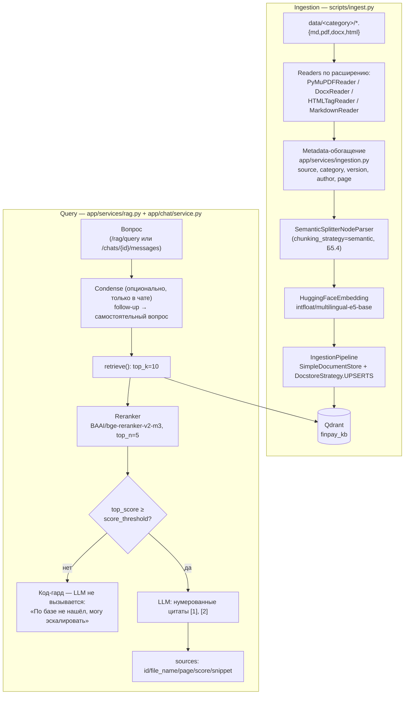

# RAG на LlamaIndex vs bare-metal (М5.3)

Поверх дипломного сервиса собран минимальный RAG-пайплайн: тот же запрос
реализован дважды — на LlamaIndex (`app/services/rag.py`) и руками, без
фреймворка (`app/services/rag_baremetal.py`). Обе версии используют один и
тот же корпус (`data/rag-block-03/`) и одну embed-модель — иначе сравнение
было бы нечестным.

## Версии зависимостей

Прогнано вживую на `uv 0.x`, установлено через `uv add`:

| Пакет | Версия |
|---|---|
| `llama-index` | 0.14.23 |
| `llama-index-core` | 0.14.23 |
| `llama-index-vector-stores-qdrant` | 0.10.2 |
| `llama-index-readers-file` | 0.6.0 |
| `llama-index-embeddings-huggingface` | 0.7.0 |
| `docx2txt` | 0.9 (доп. зависимость `llama-index-readers-file` для `.docx`, не входит в него транзитивно) |
| `llama-index-llms-openai-like` | 0.7.2 (см. ниже — почему не `llama-index-llms-openai`) |
| `qdrant-client` | 1.18.0 (уже было в проекте с М5.2) |
| `sentence-transformers` | 5.6.0 (уже было в проекте с М5.1) |

**Честная находка:** бандл `llama-index` тянет `llama-index-llms-openai`, но
эта интеграция жёстко валидирует имя модели по захардкоженному списку
реальных моделей OpenAI (`openai_modelname_to_contextsize`). В проекте OpenAI
host — Groq (`settings.openai.host`), модель — `llama-3.1-8b-instant`, и
`OpenAI(...)` падает с `ValueError: Unknown model`. Решение — отдельный пакет
`llama-index-llms-openai-like`, предназначенный ровно для OpenAI-совместимых
не-OpenAI эндпоинтов: он принимает `context_window`/`is_chat_model` явными
параметрами конструктора вместо валидации по списку.

Эмбеддинги — self-hosted HuggingFace (обоснование выбора модели см. ADR-003 в
`docs/architecture.md`), поэтому дополнительно ставится
`llama-index-embeddings-huggingface`, а не `llama-index-embeddings-openai` из
бандла.

## Решение по коллекции

Заведена отдельная коллекция `rag_block_03` (не переиспользуется `documents`
из М5.2) — LlamaIndex хранит ноды в собственном формате (`_node_content`), и
подключение к «чужой» коллекции через `from_vector_store` дало бы неполные
метаданные и `source_nodes`. Bare-metal-версия по той же причине пишет в
свою коллекцию `rag_block_03_baremetal` с плоским payload
(`{"text", "file_name"}`) — сравнивать retrieval двух версий на одной
физической коллекции с разным форматом хранения было бы некорректно.

Параметры обеих коллекций совпадают и подобраны под уже выбранную модель
эмбеддингов (М5.1): размерность 768, `Distance.COSINE`, модель
`intfloat/multilingual-e5-base`.

**Критично для честного сравнения:** модель `intfloat/multilingual-e5-base`
различает запрос и документ через текстовые префиксы `"query: "` /
`"passage: "` — это уже было учтено в `app/services/embeddings.py`
(`embed_query`/`embed_documents`). `HuggingFaceEmbedding` из LlamaIndex по
умолчанию эти префиксы не добавляет — без явных `query_instruction` /
`text_instruction` в конструкторе (см. `app/services/rag.py::build`) ретрив
на LlamaIndex-коллекции молча разошёлся бы с bare-metal-версией и с
коллекциями Б5.1/Б5.2.

## Сравнение реализаций

Строки кода — реальный подсчёт значимых строк ingestion+query (без импортов,
докстрингов и блока `if __name__`) на момент сдачи: `rag.py` — 133 строки
всего файла / ~77 значимых, `rag_baremetal.py` — 173 строки всего / ~116
значимых.

| Критерий | LlamaIndex | Bare-metal |
|---|---|---|
| Строк кода (ingestion + query, без импортов) | ~77 | ~116 |
| Поддержка форматов из коробки | `.md`/`.txt`/`.pdf`/`.docx` через `SimpleDirectoryReader` + `llama-index-readers-file` (докупить только `docx2txt`) | Только то, что написано руками: пришлось явно завести `_read_file` с веткой на `pypdf`/`python-docx` |
| Что дописать для PDF/DOCX | Ничего — уже работает после установки `llama-index-readers-file` + `docx2txt` | Полноценный парсер на каждый формат (в проекте — по ~5 строк за счёт готовых `pypdf`/`python-docx`, но в общем случае объём растёт с числом форматов) |
| Что дописать для batch-ingestion / async | `SimpleDirectoryReader` уже читает директорию рекурсивно; async — `aquery()` из коробки, `aget_query_embedding` эмбеддинга тоже асинхронный | `VectorStore.upsert` уже батчит (256 точек/запрос, из М5.2), но эмбеддинги считаются синхронно (`sentence-transformers.encode`) — под настоящий async нужно оборачивать в `asyncio.to_thread` |
| Где удобнее дебажить `top_score`/`source_nodes` | `response.source_nodes` — уже объекты с `.score`/`.metadata`/`.text`, дебажить через `pdb`/логи так же просто | То же самое, но `top_score`/payload — это то, что сам явно положил в Qdrant; меньше «магии», проще понять, откуда взялось конкретное число |
| Где гибче подменять компоненты (re-ranker, chunker) | Компоненты — стандартные интерфейсы LlamaIndex (`NodeParser`, `BaseRetriever`, `BaseSynthesizer`); re-ranker подключается как `node_postprocessor` без переписывания pipeline | Любая замена (например, semantic-чанкинг вместо посимвольного) — это переписывание конкретной функции в своём коде, но зато нет риска упереться в то, что нужного hook-а во фреймворке просто нет |

### Честная находка на реальном прогоне

На вопросе «Что делать при ошибке 429 и сколько попыток повтора у вебхуков?»
(синтез из `07_api_errors.md` + `06_webhooks.md`) LlamaIndex-версия дала верный
ответ: *«до 5 раз с интервалами 1, 5, 15, 60 и 240 минут»*. Bare-metal-версия
на том же вопросе **выдумала** интервал — *«с интервалом в 1 минуту»* — хотя
в топ-3 у неё тоже присутствовал чанк `06_webhooks.md`. Причина: наивное
посимвольное окно (512 символов, без учёта границ секций) разрезало
`06_webhooks.md` так, что в retrieved-чанк попал только раздел «Настройка»,
а раздел «Повторные попытки доставки» с конкретными интервалами не вошёл в
top-3. `SentenceSplitter` у LlamaIndex учитывает границы предложений и в этом
случае сохранил нужный фрагмент целиком. Это ровно тот класс ошибок, который
не виден на «хороших» вопросах и проявляется только на синтезе из нескольких
документов — отдельный аргумент в пользу LlamaIndex для продакшена, а не
только про экономию кода.

### Вывод

В диплом идёт **LlamaIndex-версия** (`app/services/rag.py`, подключена к
`/rag/query`). Помимо более короткого кода и готовых ридеров для PDF/DOCX,
решающим оказался практический эффект `SentenceSplitter`: наивный чанкинг
bare-metal-версии реально сломал контекст на синтетическом вопросе и привёл
к выдуманному факту, а не просто к менее аккуратному коду. Bare-metal-версия
остаётся в репозитории как образовательный артефакт и baseline для
сравнения, но не как продакшен-путь — компоненты (chunker, retriever) в ней
менять дороже, а число выигранных строк кода не окупает риск тихой деградации
качества на реальных вопросах пользователей.

## Прогон 5 вопросов

Прогнано через `POST /rag/query` (LlamaIndex) и напрямую через
`RAGBaremetalService.answer()` (bare-metal) на реальном Qdrant
(`docker compose up -d qdrant`) и реальном LLM (Groq `llama-3.1-8b-instant`).

Состав выборки: **3 хороших / 1 средний / 1 вне базы**.

### 1. «Какая стандартная комиссия за транзакцию?» — хороший

- **LlamaIndex:** «1.8% от суммы транзакции.» — top-1 `02_tariffs.md`, score 0.828.
- **Bare-metal:** «Стандартная комиссия за транзакцию в FinPay составляет 1.8% от суммы транзакции.» — top-1 `02_tariffs.md`, score 0.845.
- **Оценка:** релевантно у обеих.
- **Гипотеза:** прямое совпадение формулировки вопроса с текстом документа —
  ожидаемо простой случай для любой реализации.

### 2. «Как проверить подпись вебхука от FinPay?» — хороший

- **LlamaIndex:** корректно описала HMAC-SHA256 + `X-FinPay-Signature` +
  `hmac.compare_digest` — top-1 `06_webhooks.md`, score 0.905.
- **Bare-metal:** тот же факт, короче — top-1 `06_webhooks.md`, score 0.91.
- **Оценка:** релевантно у обеих.
- **Гипотеза:** нужный факт целиком помещается в один чанк независимо от
  способа чанкинга — расхождений не возникает.

### 3. «Сколько дней есть на оформление возврата платежа?» — хороший

- **LlamaIndex/Bare-metal:** «30 дней» у обеих — top-1 `05_refunds.md`, score
  0.859 / 0.879 соответственно.
- **Оценка:** релевантно у обеих.
- **Гипотеза:** аналогично п.1 — короткий однозначный факт, реализация
  пайплайна не влияет на результат.

### 4. «Что делать при ошибке 429 и сколько попыток повтора у вебхуков?» — средний

- **LlamaIndex:** верно объединила оба факта (retry с backoff для 429 +
  «до 5 раз с интервалами 1, 5, 15, 60 и 240 минут» для вебхуков) — top-1
  `06_webhooks.md`, score 0.841.
- **Bare-metal:** объединила факты, но **выдумала** интервал повтора
  вебхуков («с интервалом в 1 минуту») — top-1 `07_api_errors.md`, score
  0.851.
- **Оценка:** релевантно у LlamaIndex, **нерелевантно (галлюцинация)** у
  bare-metal.
- **Гипотеза:** короткий наивный чанк сломал контекст — см. разбор выше в
  разделе «Честная находка».

### 5. «Какой рецепт борща лучше использовать на корпоративе?» — вне базы

- **LlamaIndex:** «Я не могу предоставить информацию о рецепте борща,
  поскольку в предоставленном контексте нет никакой информации о
  приготовлении еды.» — top-1 `10_off_topic_office_policy.md`, score 0.766.
- **Bare-metal:** «Не нашёл информацию о рецепте борща в предоставленном
  контексте.» — top-1 `02_tariffs.md`, score 0.773.
- **Оценка:** fallback сработал корректно у обеих — но честно нужно
  отметить: **не за счёт отсечения по `score_threshold`** (0.75) — top-1
  score в обоих случаях оказался *выше* порога (0.766 / 0.773), несмотря на
  полную нерелевантность запроса. Порог был откалиброван по «хорошим»
  вопросам (0.82–0.91) и не рассчитан на то, что нерелевантный документ про
  офисные обеды векторно окажется настолько близко к вопросу про еду в
  принципе.
- **Гипотеза:** fallback здесь сработал не по порогу similarity, а благодаря
  тому, что LLM честно увидела в топ-3 контексте отсутствие релевантной
  информации и отказалась отвечать вместо того, чтобы галлюцинировать. Это
  рабочий, но более хрупкий механизм защиты от «не знаю», чем отсечение по
  score — граница `score_threshold = 0.75` в `app/settings/rag.py` для
  продакшена стоит либо поднять, либо дополнить эту эвристику явной
  проверкой домена вопроса.

Ниже — как эта хрупкость решается в Б5.5 включением re-ranking.

## Блок 5.5 — корпоративная сборка

Продолжение того же сервиса (`app/services/rag.py`, `/rag/query`), теперь
поверх полного корпоративного корпуса (`data/<category>/...`, 50+ документов,
4 формата — см. `docs/data_inventory.md`) и с полным query-пайплайном:
re-ranking, нумерованные цитаты, код-гард до вызова LLM, подключение к
multi-turn чату (М4) и к Telegram-боту.

### Архитектура: два контура

### Ingestion: мультиформатный, инкрементальный

`scripts/ingest.py data/` читает каждый файл специализированным ридером по
расширению (все 4 формата из задания подключены — PDF/DOCX/HTML/MD),
обогащает метаданными (`app/services/ingestion.py`: `source`, `category` из
пути, `version` из имени файла, `author` из DOCX core properties,
`last_modified` из stat; шумные поля исключены из эмбеддинга через
`excluded_embed_metadata_keys`) и проводит через `IngestionPipeline` с
`SimpleDocumentStore` + `DocstoreStrategy.UPSERTS`: докстор персистится в
`settings.rag.docstore_path`, поэтому повторный прогон без изменений в
файлах не дублирует чанки — `pipeline.run()` пропускает документы с
совпадающим хешем (проверено: второй прогон на том же корпусе — «0 changed,
N unchanged»). Файлы, которые не удалось распарсить (битый PDF, HTML без
ожидаемого `<section>`), переименовываются в `<имя>.failed`, ошибка
логируется, остальная индексация не блокируется.

### Параметры chunking (наследие Б5.4)

Продакшен-ingestion использует ту же стратегию, что победила в эксперименте
блока 5.4 (`docs/chunking_experiment.md`, golden dataset из 28 вопросов):
`chunking_strategy = "semantic"` (`SemanticSplitterNodeParser`,
`buffer_size=1`, `breakpoint_percentile_threshold=95`) — граница чанка
проходит по семантическому разрыву соседних предложений, а не по фиксированному
числу токенов. Baseline на случай, если бы Б5.4 был пропущен, — `chunk_size=512`,
`chunk_overlap=64` (fixed/recursive из `app/services/chunking.py`); эти же
значения остаются дефолтом настроек (`app/settings/rag.py`) на случай смены
стратегии.

### Re-ranker: включён в Б5.5

`BAAI/bge-reranker-v2-m3` (`app/services/reranker.py`, `CrossEncoder`) в
Б5.4 был отключён по умолчанию — корпус из 10 документов уже насыщал
retrieval на top-10, а re-ranking на CPU медленнее в ~28 раз (см. раздел
выше). В Б5.5 корпус вырос до 50+ документов из 10 категорий: грубый
cosine-retrieval на таком объёме отдаёт заметно более шумный top-10, и
re-ranking включён по умолчанию (`reranker_enabled = True`) — `retrieve()`
берёт `similarity_top_k=10` кандидатов и сужает до `rerank_top_n=5`.

**Честная находка (перепроверено вживую на полном корпусе, не на 2-3
подобранных примерах).** Первая версия этого раздела утверждала, что
`CrossEncoder.predict()` даёт сигмоид-нормализованный score, кучкующийся
0.87–0.98 для релевантных пар — это оказалось неверно как обобщение:
подтверждено только на удобных примерах с прямым лексическим совпадением.
На реальных вопросах к корпусу картина другая:

| Запрос | Найденный документ (верный) | top_score после re-rank |
|---|---|---|
| «Как оформить возврат платежа?» | `05_refunds.md` | 0.958 |
| «Как настроить вебхуки?» | — | 0.993 |
| «Какая комиссия за эквайринг?» | `02_tariffs.md` | 0.442 |
| «Какой лимит на возврат платежа?» | `05_refunds.md` | 0.032 |
| «Как подключить 1С интеграцию?» | `01_1c_integration.html` | 0.01–0.013 |
| «Какой рецепт борща лучше?» (вне базы) | — | 0.0000 |

Разброс для *одинаково верных* попаданий — от 0.01 до 0.99. Дальнейшая
диагностика (один и тот же фрагмент про интеграцию с 1С, разные
формулировки вопроса) показала причину — модель крайне чувствительна к
формулировке на русском: короткие запросы в стиле ключевых слов оцениваются
на порядок выше естественных вопросов с «как»:

| Формулировка (один и тот же фрагмент) | Score |
|---|---|
| «1С интеграция FinPay» | 0.9997 |
| «Интеграция с 1С» | 0.899 |
| «Как настроить синхронизацию с 1С Предприятие?» | 0.060 |
| «Как подключить 1С интеграцию?» | 0.013 |

Более того, в зоне низких score (0.01–0.03) reranker **не различает надёжно**
правильный документ от случайного: на повторном прогоне того же вопроса про
1С топ-1 в одном случае оказался `01_1c_integration.html` (верно), а в
другом — `04_launch_checklist.pdf` (не по теме) с тем же ~0.01. Это не баг
пайплайна (воспроизведено напрямую через `CrossEncoder.predict()` в обход
всего сервиса) — это реальная шумность модели в этом диапазоне.

### Threshold для отказа: 0.005, и это не «уверенность», а фильтр мусора

`score_threshold = 0.75` (Б5.3/5.4) был откалиброван под чистый cosine
similarity retrieval **без** re-ranker. После включения re-ranker в Б5.5
код-гард в `RAGService.retrieve()` стал сравнивать порог с score
**после re-ranking** — несопоставимой шкалой (см. находку выше): 0.75
отсекал бы почти все верные ответы («1С» — 0.01, «лимит на возврат» —
0.032). Порог понижен до **0.005**.

Это число нужно понимать честно: оно разделяет только «однозначно вне
темы» (стабильно 0.0000 на всех проверенных нерелевантных вопросах) от
«что угодно, хоть немного похожее» — не более того. Это **не** confidence
gate в смысле «выше порога — модель уверена в правильном документе»: в
диапазоне 0.005–0.05 reranker может как найти нужный документ, так и
случайный с тем же score (см. пример с `04_launch_checklist.pdf` выше).

Практический вывод: заявленная в задании «двухслойная защита» (код +
промпт) в реальности сильно смещена ко второму слою. Числовой порог ловит
только очевидный мусор (борщ, футбол — уверенно 0.0000); реальная защита от
галлюцинации на неоднозначных, но топически близких вопросах — промпт-
инструкция `CITATION_SYSTEM_PROMPT` («если в контексте нет ответа — ответь
ровно [REFUSAL_ANSWER]»), которая у LLM отрабатывает даже когда код-гард
уже пропустил слабый матч дальше.

**TODO (Б5.6):** нормальная калибровка нужна на golden dataset, а не на
разовых замерах. Кандидат для более честного code-guard — гейтить по score
**retrieval** (до re-ranking, cosine similarity, у него разброс уже, хотя
тоже не идеален — см. пример с борщом в разделе Б5.3/5.4 выше), а
re-ranker использовать только для переупорядочивания топ-5, не для
решения «отвечать или нет».

### Multi-turn (М4) и score-guard в чате

RAG подключён к `ChatService.send_message` (`app/chat/service.py`) —
подробности и диаграмма см. `docs/chat.md`, раздел «RAG в чате». Кратко:
опциональный condense-шаг чинит retrieval для follow-up вопросов
(`chat.rag_condense_enabled`, по умолчанию включён). **В отличие от
`/rag/query`, код-гард в чате не обрывает генерацию** — при низком score
просто не добавляется RAG-контекст, и LLM отвечает по обычному системному
промпту (у него своё правило честного отказа). Причина: сообщения в чате —
это не только фактические вопросы к базе, но и приветствия/small-talk
(«Привет», «тест»), для которых низкий RAG-score ожидаем и не должен
блокировать ответ целиком. Источники всё равно уходят клиенту финальным
SSE-событием `event: sources`, если retrieval вообще запускался.

### Endpoints

| Endpoint | Назначение |
|---|---|
| `POST /rag/query` | Одношаговый ответ (синхронно), с цитатами `[1]`/`[2]`, `confident`, `sources` |
| `POST /chats/{id}/messages` | Multi-turn с SSE (`token`/`done`/`event: sources`), condense, score-guard |
| `POST /documents/upload` | Загрузка нового документа → `202` → инкрементальная индексация в фоне (`BackgroundTasks`, `DocstoreStrategy.UPSERTS`) |
| `GET /chats/{id}/messages` | История диалога |
| `DELETE /chats/{id}/messages` | Мягкое удаление истории |
| `POST /chats/{id}/messages/{mid}/feedback` | Оценка ответа (`up`/`down`) + опционально показанные `sources` (Б5.5) |

Данные — `docs/data_inventory.md` (50+ документов, 4 формата, разбивка по
категориям и размеру).
